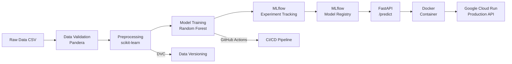

# MLOps Pipeline 🚀

An end-to-end MLOps pipeline built over 10 days, covering data ingestion,
model training, experiment tracking, API serving, containerization,
cloud deployment, and monitoring.

---

## Architecture



## Project Structure
mlops-pipeline/
├── .github/workflows/   # CI/CD pipelines
├── data/
│   ├── raw/             # Raw wine quality dataset
│   └── processed/       # Preprocessed features
├── docs/                # Documentation and plans
├── models/              # Saved model artifacts
├── notebooks/           # EDA notebooks
├── src/
│   ├── api/             # FastAPI application
│   │   └── main.py
│   ├── data_ingestion.py
│   ├── data_validation.py
│   ├── preprocessing.py
│   └── train.py
├── dvc.yaml             # DVC pipeline definition
├── Dockerfile           # Container definition
└── requirements.txt


---

## Setup

### 1. Clone the repository
```bash
git clone https://github.com/Kohei-Uehara-VIP/mlops-pipeline.git
cd mlops-pipeline
```

### 2. Create conda environment
```bash
conda create -n mlops-pipeline python=3.10 -y
conda activate mlops-pipeline
pip install -r requirements.txt
```

### 3. Run the pipeline
```bash
dvc repro
```

### 4. Start MLflow UI
```bash
mlflow ui
```
Open http://127.0.0.1:5000 in your browser.

### 5. Start the API locally
```bash
uvicorn src.api.main:app --reload
```

---

## API Endpoints

### Health Check
```bash
curl https://wine-quality-api-880793502173.asia-northeast1.run.app/health
```
Response:
```json
{"status": "ok"}
```

### Predict Wine Quality
```bash
curl -X POST "https://wine-quality-api-880793502173.asia-northeast1.run.app/predict" \
  -H "Content-Type: application/json" \
  -d '{
    "fixed_acidity": 7.4,
    "volatile_acidity": 0.70,
    "citric_acid": 0.00,
    "residual_sugar": 1.9,
    "chlorides": 0.076,
    "free_sulfur_dioxide": 11.0,
    "total_sulfur_dioxide": 34.0,
    "density": 0.9978,
    "pH": 3.51,
    "sulphates": 0.56,
    "alcohol": 9.4
  }'
```
Response:
```json
{"prediction": 6}
```

---

## Tech Stack

| Layer | Tool |
|-------|------|
| Data Versioning | DVC |
| Data Validation | Pandera |
| Experiment Tracking | MLflow |
| Model Registry | MLflow Model Registry |
| API Framework | FastAPI |
| Containerization | Docker |
| Cloud Deployment | Google Cloud Run |
| CI/CD | GitHub Actions |
| Logging | structlog |

---

## Dataset

[Wine Quality Dataset](https://archive.ics.uci.edu/ml/datasets/wine+quality)
from UCI Machine Learning Repository.
- 1,599 red wine samples
- 11 physicochemical features
- Quality score: 3–9


