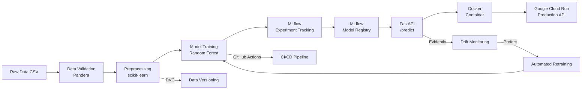
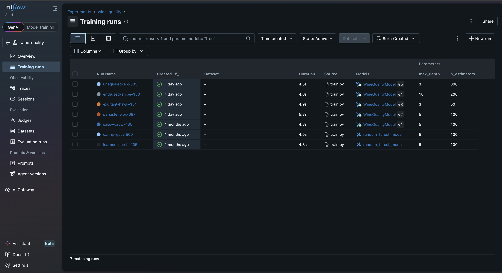
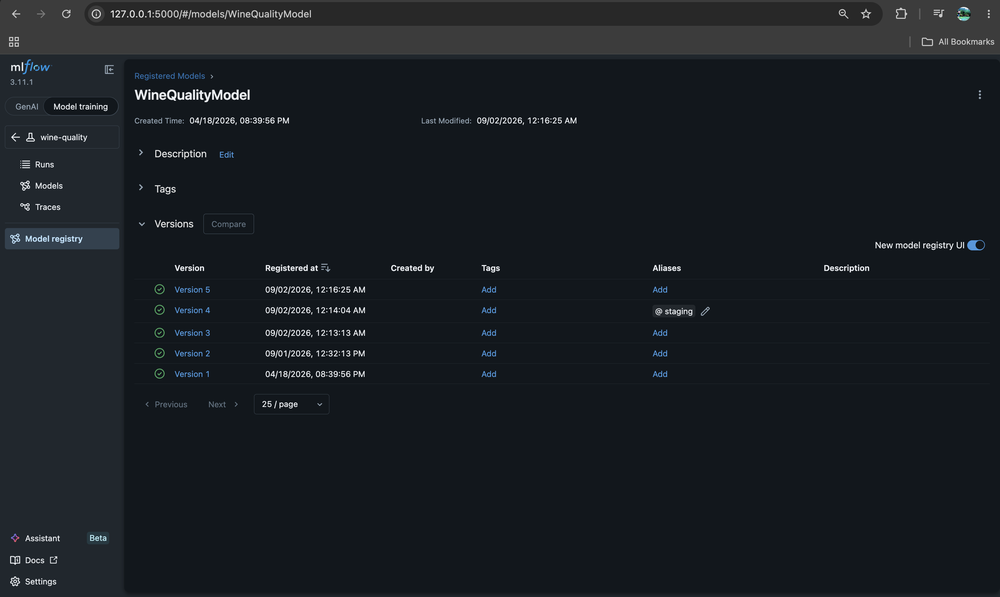
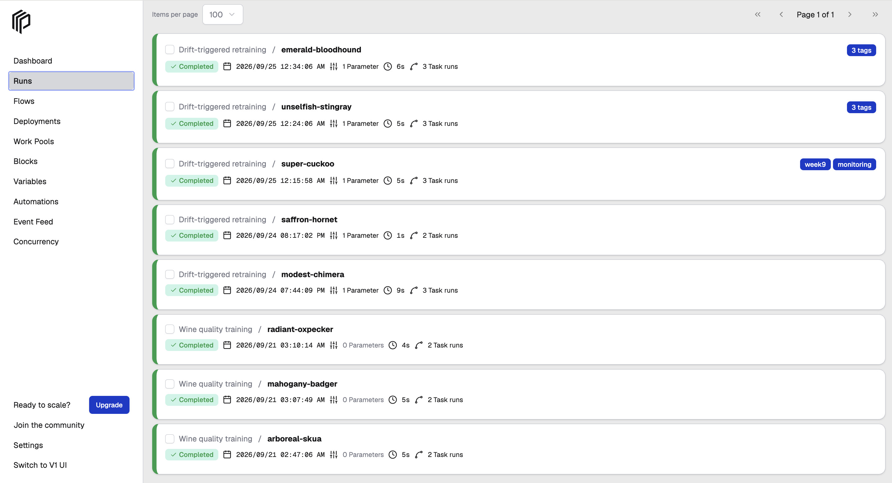

# MLOps Pipeline 🚀

An end-to-end MLOps pipeline built over 10 days, covering data ingestion,
model training, experiment tracking, API serving, containerization,
cloud deployment, and monitoring.

---

## Architecture


```mermaid
graph LR
    A[Raw Data CSV] --> B[Data Validation\nPandera]
    B --> C[Preprocessing\nscikit-learn]
    C --> D[Model Training\nRandom Forest]
    D --> E[MLflow\nExperiment Tracking]
    E --> F[MLflow\nModel Registry]
    F --> G[FastAPI\n/predict]
    G --> H[Docker\nContainer]
    H --> I[Google Cloud Run\nProduction API]
    C --> |DVC| J[Data Versioning]
    D --> |GitHub Actions| K[CI/CD Pipeline]
    G --> |Evidently| L[Drift Monitoring]
    L --> |Prefect| M[Automated Retraining]
    M --> D
```

## Project Structure
mlops-pipeline/
├── .github/workflows/   # CI/CD pipelines
├── data/
│   ├── raw/             # Raw wine quality dataset
│   └── processed/       # Preprocessed features
├── docs/                # Documentation and plans
├── models/              # Saved model artifacts
├── notebooks/           # EDA notebooks
├── reports/             # Generated drift reports (git-ignored)
├── src/
│   ├── api/             # FastAPI application
│   │   └── main.py
│   ├── data_ingestion.py
│   ├── data_validation.py
│   ├── preprocessing.py
│   ├── train.py
│   ├── drift_report.py      # Evidently HTML drift report
│   ├── drift_check.py       # Evidently Test Suite (JSON pass/fail)
│   ├── training_flow.py     # Prefect flow: preprocess + train
│   ├── retraining_flow.py   # Prefect flow: drift-triggered retraining
│   └── serve_flow.py        # Prefect deployment on a schedule
├── dvc.yaml             # DVC pipeline definition
├── Dockerfile           # Container definition
└── requirements.txt


---

## Setup

### 1. Clone the repository
```bash
git clone https://github.com/Kohei-Uehara-VIP/mlops-pipeline.git
cd mlops-pipeline
```

### 2. Create conda environment
```bash
conda create -n mlops-pipeline python=3.10 -y
conda activate mlops-pipeline
pip install -r requirements.txt
```

### 3. Run the pipeline
```bash
dvc repro
```

### 4. Start MLflow UI
```bash
mlflow ui
```
Open http://127.0.0.1:5000 in your browser.

### 5. Start the API locally
```bash
uvicorn src.api.main:app --reload
```

---

## API Endpoints

### Health Check
```bash
curl https://wine-quality-api-880793502173.asia-northeast1.run.app/health
```
Response:
```json
{"status": "ok"}
```

### Predict Wine Quality
```bash
curl -X POST "https://wine-quality-api-880793502173.asia-northeast1.run.app/predict" \
  -H "Content-Type: application/json" \
  -d '{
    "fixed_acidity": 7.4,
    "volatile_acidity": 0.70,
    "citric_acid": 0.00,
    "residual_sugar": 1.9,
    "chlorides": 0.076,
    "free_sulfur_dioxide": 11.0,
    "total_sulfur_dioxide": 34.0,
    "density": 0.9978,
    "pH": 3.51,
    "sulphates": 0.56,
    "alcohol": 9.4
  }'
```
Response:
```json
{"prediction": 6}
```
---

## Reproducing Experiments with MLflow

All training runs are tracked locally with MLflow (`sqlite:///mlflow.db`).

### 1. Run the training script

```bash
python src/train.py --n_estimators 200 --max_depth 10
```

- `--n_estimators` / `--max_depth`: override the model's hyperparameters
  (defaults: 200 / 10, the best-performing combination found so far).
- Each run logs parameters, metrics (`accuracy`, `f1_score`), and a
  confusion matrix image to the `wine-quality` experiment, and registers
  the resulting model as a new version of `WineQualityModel`.

### 2. View results in the MLflow UI

```bash
mlflow ui
```

Open [http://127.0.0.1:5000](http://127.0.0.1:5000), then go to
**Model training → Training runs** to compare runs, or
**Model registry → WineQualityModel** to see registered versions.

Example: 7 runs with different `n_estimators` / `max_depth` combinations,
compared side by side in the Training runs table:



The best-performing version is tagged with the `staging` alias in the
Model Registry:



---

## Serving a Model Directly from the Registry

Instead of loading a static `model.pkl`, MLflow can serve any registered
model version directly, by name and alias.

### 1. Promote a version to `staging`

```bash
python scripts/promote_model.py
```

This assigns the `staging` alias to a chosen version of `WineQualityModel`
(see `scripts/promote_model.py` to change which version).

### 2. Serve the aliased version

```bash
mlflow models serve -m "models:/WineQualityModel@staging" --port 5001 --env-manager local
```

### 3. Validate the running server

```bash
python scripts/test_serving.py
```

Sends a sample payload to `http://127.0.0.1:5001/invocations` and prints
the prediction, confirming the server is live and responding correctly.

---

## CI/CD Pipeline (GitHub Actions)

Defined in `.github/workflows/ci.yml`, triggered on every push and pull
request to `main`. Three independent jobs run in parallel:

| Job | Purpose |
|-----|---------|
| `lint` | Runs `flake8` against `src/` to enforce code style |
| `test` | Runs `pytest tests/` to catch functional regressions |
| `cml_report` | Re-trains the model and posts an evaluation report as a PR comment |


### Continuous Machine Learning (CML) reports

The `cml_report` job downloads the public dataset, retrains the model,
and uses [CML](https://cml.dev) to post a comment on the pull request
containing the run's parameters, metrics, and confusion matrix —
so reviewers can see the performance impact of a change without
leaving GitHub.


To trigger it yourself:

```bash
git checkout -b my-experiment
# edit src/train.py hyperparameter defaults, or any other change
git add -A && git commit -m "experiment: describe your change"
git push vip my-experiment
# then open a Pull Request on GitHub targeting main
```
---

## Monitoring and Automated Retraining

Model quality degrades in production when incoming data stops resembling
the training data. This part of the pipeline detects that shift and
retrains the model automatically.

### Why monitor data drift, and how Evidently AI does it

Evidently compares two datasets column by column with statistical tests:

- **reference** — the training data (`data/processed/X_train.csv`)
- **current** — simulated production data (`data/processed/X_test.csv`)

`src/drift_report.py` produces an interactive HTML report
(`reports/drift_report.html`) for humans to read. `src/drift_check.py`
turns the same comparison into a machine-readable pass/fail result
(`reports/drift_check.json`) that a pipeline can act on without a human
looking at a dashboard.

Drift is simulated by shifting the `alcohol` and `sulphates` columns by
+1.0. The processed data is standardized, so +1.0 means one standard
deviation. Because the data is standardized, the report's axes show
standardized values rather than real units such as alcohol percentage.

**Threshold.** The check fails when the share of drifted columns reaches
0.3. With 11 columns, up to 3 drifted columns pass and 4 or more fail.
Two columns drift by chance alone (0.18), so 0.3 separates random
variation from the injected drift.

The test suite also runs `DataStabilityTestPreset` and
`DataQualityTestPreset`. Their results are logged for information, but
only the drift test decides whether the pipeline retrains. For example,
the row-count test always fails because the test split is smaller than
the training split, which is expected rather than a data problem.

**Version note.** Evidently is pinned to `0.6.7` because the `TestSuite`
API used here was removed in later versions.
`TestShareOfDriftedColumns` was added on top of the two presets because
neither preset measures data drift.

### How Prefect orchestration dictates the pipeline logic

`src/retraining_flow.py` is a conditional flow:

| Task | Action |
|------|--------|
| Ingest production data | Load reference data and simulated production data |
| Check data drift | Run the Evidently Test Suite and return `True` / `False` |
| Retrain model | Runs only when drift was detected |

The flow branches on the boolean returned by `is_drift_detected()`.
A clean run records two task runs and skips retraining; a drifted run
records three task runs and registers a new model version in MLflow.
The Prefect dashboard shows this difference as a dynamic execution path:



`src/training_flow.py` is the simpler flow from the same week:
preprocessing followed by training, with no branching.

### Running the monitoring pipeline locally

Three terminals are used, each with the `mlops-pipeline` conda
environment activated.

**1. Start the Prefect server** (terminal 1):

```bash
prefect server start
```

The dashboard is served at http://127.0.0.1:4200. Point the client at
the server once, on any terminal:

```bash
prefect config set PREFECT_API_URL=http://127.0.0.1:4200/api
```

**2. Run a flow manually** (terminal 2):

```bash
python -m src.drift_report                 # HTML drift report
python -m src.drift_check                  # JSON pass/fail, exits 1 on drift
python -m src.retraining_flow              # drifted data, retrains
python -m src.retraining_flow --no-drift   # clean data, skips retraining
```

**3. Run on a schedule** (terminal 3):

```bash
python -m src.serve_flow
```

This creates the deployment `drift-retraining-every-10-min` and keeps
polling for scheduled runs every 10 minutes. Keep the process running.
To trigger a run immediately without waiting for the schedule:

```bash
prefect deployment run 'Drift-triggered retraining/drift-retraining-every-10-min'
```

### Known limitations

- Retraining reruns the existing training data; newly ingested production
  data is not yet added to the training set.
- Production data is simulated from the test split, not collected from a
  live service.
- Installing these tools changed two pinned versions: `numpy` was
  downgraded to `2.0.2` for Evidently, and `fastapi` was upgraded to
  `0.141.1` for Prefect. Both are reflected in `requirements.txt`.

---

## Tech Stack

| Layer | Tool |
|-------|------|
| Data Versioning | DVC |
| Data Validation | Pandera |
| Experiment Tracking | MLflow |
| Model Registry | MLflow Model Registry |
| API Framework | FastAPI |
| Containerization | Docker |
| Cloud Deployment | Google Cloud Run |
| CI/CD | GitHub Actions |
| Drift Monitoring | Evidently AI |
| Workflow Orchestration | Prefect |
| Logging | structlog |

---

## Dataset

[Wine Quality Dataset](https://archive.ics.uci.edu/ml/datasets/wine+quality)
from UCI Machine Learning Repository.
- 1,599 red wine samples
- 11 physicochemical features
- Quality score: 3–9
