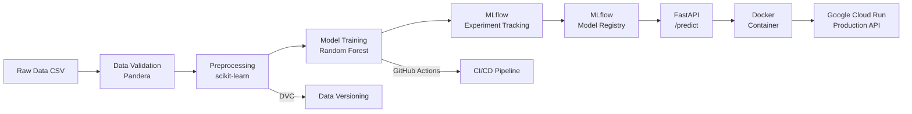
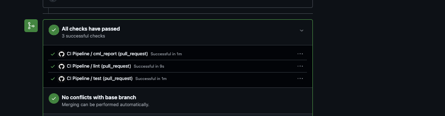
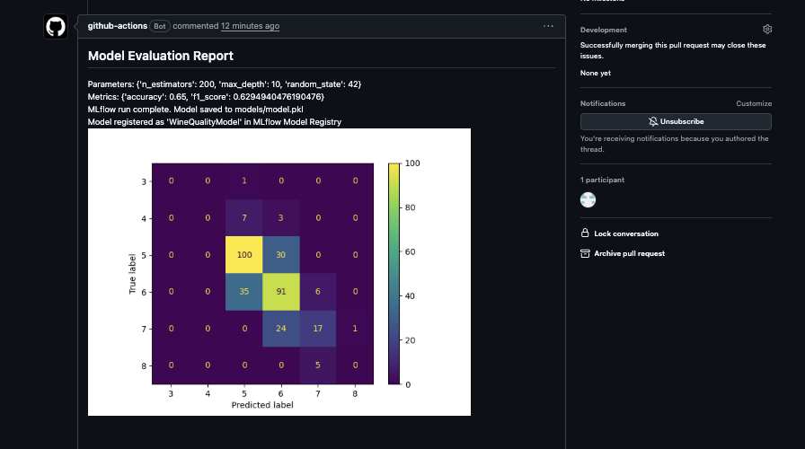

# MLOps Pipeline 🚀

An end-to-end MLOps pipeline built over 10 days, covering data ingestion,
model training, experiment tracking, API serving, containerization,
cloud deployment, and monitoring.

---

## Architecture


```mermaid
graph LR
    A[Raw Data CSV] --> B[Data Validation\nPandera]
    B --> C[Preprocessing\nscikit-learn]
    C --> D[Model Training\nRandom Forest]
    D --> E[MLflow\nExperiment Tracking]
    E --> F[MLflow\nModel Registry]
    F --> G[FastAPI\n/predict]
    G --> H[Docker\nContainer]
    H --> I[Google Cloud Run\nProduction API]
    C --> |DVC| J[Data Versioning]
    D --> |GitHub Actions| K[CI/CD Pipeline]
```

## Project Structure
mlops-pipeline/
├── .github/workflows/   # CI/CD pipelines
├── data/
│   ├── raw/             # Raw wine quality dataset
│   └── processed/       # Preprocessed features
├── docs/                # Documentation and plans
├── models/              # Saved model artifacts
├── notebooks/           # EDA notebooks
├── src/
│   ├── api/             # FastAPI application
│   │   └── main.py
│   ├── data_ingestion.py
│   ├── data_validation.py
│   ├── preprocessing.py
│   └── train.py
├── dvc.yaml             # DVC pipeline definition
├── Dockerfile           # Container definition
└── requirements.txt


---

## Setup

### 1. Clone the repository
```bash
git clone https://github.com/Kohei-Uehara-VIP/mlops-pipeline.git
cd mlops-pipeline
```

### 2. Create conda environment
```bash
conda create -n mlops-pipeline python=3.10 -y
conda activate mlops-pipeline
pip install -r requirements.txt
```

### 3. Run the pipeline
```bash
dvc repro
```

### 4. Start MLflow UI
```bash
mlflow ui
```
Open http://127.0.0.1:5000 in your browser.

### 5. Start the API locally
```bash
uvicorn src.api.main:app --reload
```

---

## API Endpoints

### Health Check
```bash
curl https://wine-quality-api-880793502173.asia-northeast1.run.app/health
```
Response:
```json
{"status": "ok"}
```

### Predict Wine Quality
```bash
curl -X POST "https://wine-quality-api-880793502173.asia-northeast1.run.app/predict" \
  -H "Content-Type: application/json" \
  -d '{
    "fixed_acidity": 7.4,
    "volatile_acidity": 0.70,
    "citric_acid": 0.00,
    "residual_sugar": 1.9,
    "chlorides": 0.076,
    "free_sulfur_dioxide": 11.0,
    "total_sulfur_dioxide": 34.0,
    "density": 0.9978,
    "pH": 3.51,
    "sulphates": 0.56,
    "alcohol": 9.4
  }'
```
Response:
```json
{"prediction": 6}
```
---

## Reproducing Experiments with MLflow

All training runs are tracked locally with MLflow (`sqlite:///mlflow.db`).

### 1. Run the training script

```bash
python src/train.py --n_estimators 200 --max_depth 10
```

- `--n_estimators` / `--max_depth`: override the model's hyperparameters
  (defaults: 200 / 10, the best-performing combination found so far).
- Each run logs parameters, metrics (`accuracy`, `f1_score`), and a
  confusion matrix image to the `wine-quality` experiment, and registers
  the resulting model as a new version of `WineQualityModel`.

### 2. View results in the MLflow UI

```bash
mlflow ui
```

Open [http://127.0.0.1:5000](http://127.0.0.1:5000), then go to
**Model training → Training runs** to compare runs, or
**Model registry → WineQualityModel** to see registered versions.

---

## Serving a Model Directly from the Registry

Instead of loading a static `model.pkl`, MLflow can serve any registered
model version directly, by name and alias.

### 1. Promote a version to `staging`

```bash
python scripts/promote_model.py
```

This assigns the `staging` alias to a chosen version of `WineQualityModel`
(see `scripts/promote_model.py` to change which version).

### 2. Serve the aliased version

```bash
mlflow models serve -m "models:/WineQualityModel@staging" --port 5001 --env-manager local
```

### 3. Validate the running server

```bash
python scripts/test_serving.py
```

Sends a sample payload to `http://127.0.0.1:5001/invocations` and prints
the prediction, confirming the server is live and responding correctly.

---

## CI/CD Pipeline (GitHub Actions)

Defined in `.github/workflows/ci.yml`, triggered on every push and pull
request to `main`. Three independent jobs run in parallel:

| Job | Purpose |
|-----|---------|
| `lint` | Runs `flake8` against `src/` to enforce code style |
| `test` | Runs `pytest tests/` to catch functional regressions |
| `cml_report` | Re-trains the model and posts an evaluation report as a PR comment |



### Continuous Machine Learning (CML) reports

The `cml_report` job downloads the public dataset, retrains the model,
and uses [CML](https://cml.dev) to post a comment on the pull request
containing the run's parameters, metrics, and confusion matrix —
so reviewers can see the performance impact of a change without
leaving GitHub.



To trigger it yourself:

```bash
git checkout -b my-experiment
# edit src/train.py hyperparameter defaults, or any other change
git add -A && git commit -m "experiment: describe your change"
git push vip my-experiment
# then open a Pull Request on GitHub targeting main
```
---

## Tech Stack

| Layer | Tool |
|-------|------|
| Data Versioning | DVC |
| Data Validation | Pandera |
| Experiment Tracking | MLflow |
| Model Registry | MLflow Model Registry |
| API Framework | FastAPI |
| Containerization | Docker |
| Cloud Deployment | Google Cloud Run |
| CI/CD | GitHub Actions |
| Logging | structlog |

---

## Dataset

[Wine Quality Dataset](https://archive.ics.uci.edu/ml/datasets/wine+quality)
from UCI Machine Learning Repository.
- 1,599 red wine samples
- 11 physicochemical features
- Quality score: 3–9


